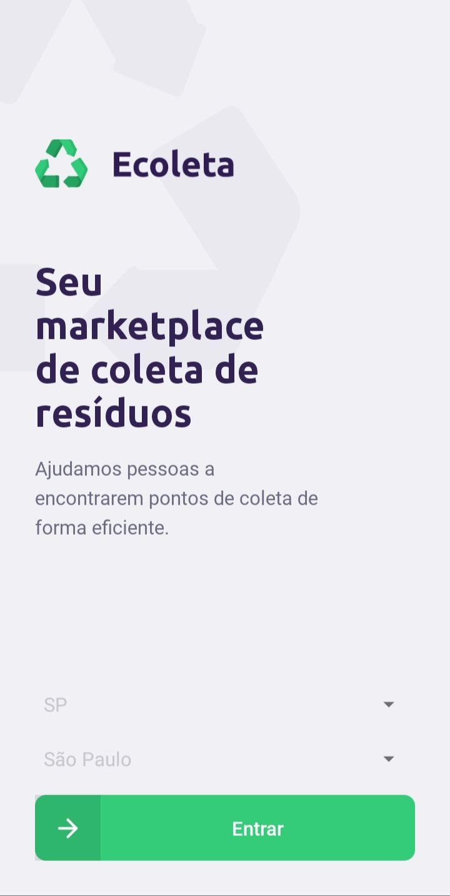
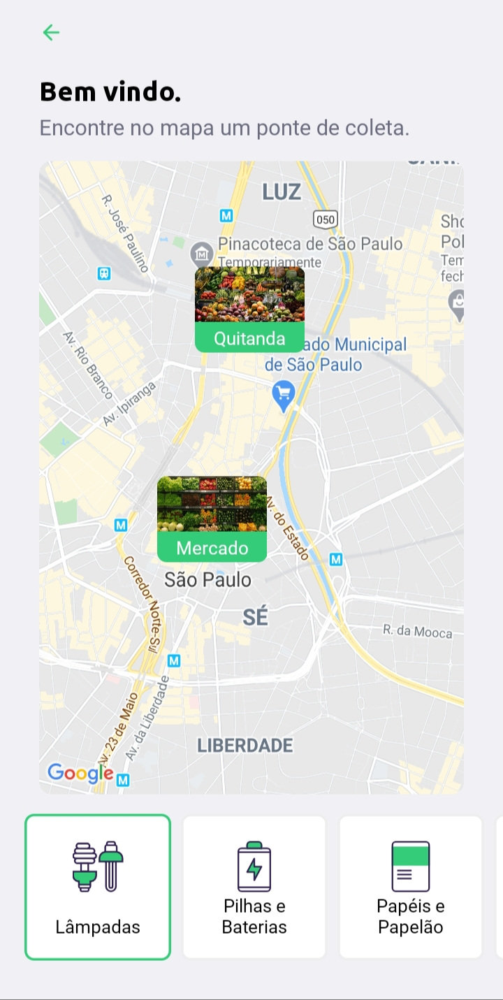
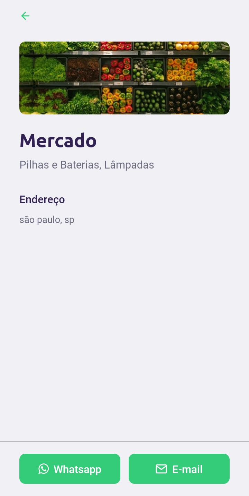

# Ecoleta Mobile
Ecoleta é um projeto da [NVW](https://nextlevelweek.com/) entre os dias 01/06/2020 até 07/06/2020, sobre uma aplicação que interliga o usuário com instituições de coleta de materiais recicláveis.

## Telas do prjeto
Tela inicial da aplicação:<br><br>


Tela de listagem de pontos de coleta:<br><br>


Tela de detalhes do ponto:<br><br>


## Como executar o projeto.
Utilize o node na versão 12.16.3

Efetue o clone do projeto:
```bash
git clone https://github.com/Architect42/ecoleta-mobile.git
```

Acesse a pasta do projeto e atualize as dependências do projeto com o comando:
```bash
npm install
```

Para poder executar o projeto:
```bash
npm install -g expo
```

Comando para rodar o projeto:
```bash
npm run dev
```